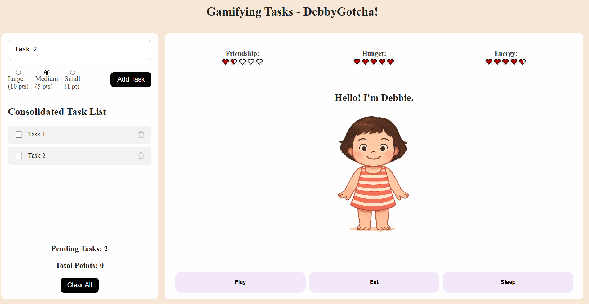

# DebbyGotcha! - Gamifying Tasks



DebbyGotcha! is a web application that gamifies your daily tasks by combining a task management system with a Tamagotchi-inspired virtual friend named Debbie. The character was inspired by my quirky friend Debbie.

Complete tasks to earn points and use those points to interact with Debbie and discover her quirkiness for yourself.

## Features

- **Task Management:**  
  Create, check off, and clear tasks. Each task has a priority that awards a different number of points when completed.

- **Virtual Game:**  
  Use your earned points to play mini-games with Debbie. Engage in activities like dancing, crocheting, exercising, and more. Each action affects Debbie's stats such as friendship, hunger, and energy.

- **Animated Interactions:**  
  Debbie features simple animations that change based on your interactions. For example, if you try an activity without enough points, Debbie shows an angry animation.

- **Responsive UI:**  
  The interface is designed with CSS Grid and modern styling, ensuring a clean and organized layout.

## Getting Started

### Prerequisites

- A modern web browser (Chrome, Firefox, Safari, Edge, etc.)
- A code editor (optional, for making modifications)

### Installation

1. **Clone the Repository:**

   ```bash
   git clone https://github.com/yourusername/debbygotcha.git
   cd debbygotcha
   ```

2. **Run Locally:**

   Open `index.html` in your web browser. For a better development experience, consider using a local server. For example, if you have Python installed, run:

   ```bash
   python -m http.server 8000
   ```

   Then navigate to http://localhost:8000 in your browser.

## File Structure

1. **index.html:**
   Main HTML file that structures the application.
2. **style.css:**
   Contains all styling, including layout, animations, and responsive design.
3. **app_todo.js:**
   Manages the task list functionality—adding, updating, and deleting tasks, and point calculations.
4. **app_tama.js:**
   Handles the Tamagotchi game logic, including Debbie's state, animations, and activity interactions.
5. **assets/:**
   Directory containing image assets for Debbie’s animations, heart icons, and other graphics.

## Attributions

1. **YouTube Tutorial** [Make a Responsive To-Do List App in HTML, CSS & JavaScript](https://www.youtube.com/watch?v=9Wi2a5_3umU) – Referenced for building the foundational structure of the task system.

2. **ChatGPT-4o** –
   Used for generating image assets used within the game.

3. **Tamagotchi UI Prototype** on [Figma](https://www.figma.com/community/file/948878461090991148/tamagotchi-concept) –
   Used as inspiration for the user interface and overall visual style.

4. **General Assembly – Tamagotchi Lab Guide** – Provided guidance and structure for the tamagotchi game's core logic and features.

5. **[Music track: Fancy Park by Piki](https://freetouse.com/music)** - For background music; Free Music No Copyright

## Technologies Used

- **HTML** – Markup structure for the application
- **CSS** – Styling and responsive layout
- **JavaScript** – Game logic, interactivity, and DOM manipulation

## Code Improvements & Future Enhancements

- **Visual Cues for Tasks Prioritisation:**
  Color coding task based on task size/priorities

- **Enhanced Animations:**
  Improve animation smoothness and refine timing for a more polished and engaging user experience.

- **Persistent Data Storage & User Accounts:**
  Enable user login and store user progress using persistent storage.

- **Responsive Design:**
  Apply media queries and design optimisations for a seamless experience across mobile and desktop devices.
